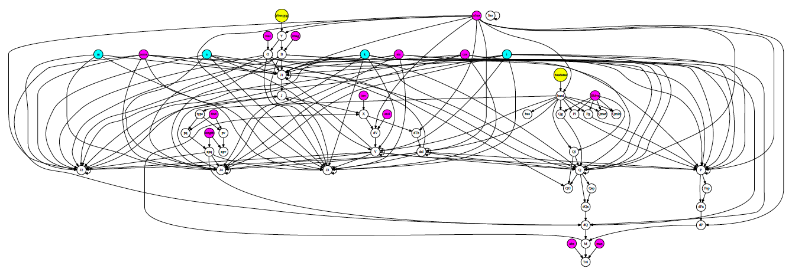
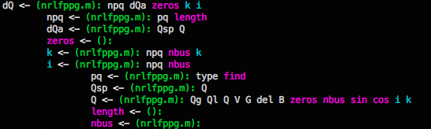

#MATLAB variable dependency analyzer (beta)

## Features
This tool creates a graph of variable dependencies in MATLAB projects, intended for exploring a new MATLAB project, debugging, etc. You can arbitrarily specify the variable of interest, depth of the graph, variables to exclude from the result (since drawing all variables makes the output unreadable), mark specified variables with a different color, etc.

The statement

    A(B(1:N)) = func(a,b,c) + exp(D)

creates edges and nodes in the dependency graph

    A <- B, N, func, a, b, c, exp, D

A similar tool, m2html, creates a dependency graph (script call relationship) of *.m files. This tool tries to go one step further and draw a graph of the dependency of variables.

This tool can be used to track down the cause of unwanted NaN, Inf, complex numbers etc. in your MATLAB project. The attatched `checkvars.m` is a simple assertion checker that detects NaN variables and outputs a list. You can specify and mark such variables with a different color, or exclude such variables from the result for smooth analysis.

This tool has a very simple implementation and still has many limitations, since it mostly only recognizes basic assignment statements.

## Usage
1. Place all *.m files in the same directory as this file
2. Call `python vargraph.py -r <myvar>` from the terminal (multiple vars, maximum graph depths can be specified)

The full usage is as follows:

    Usage:
        python vargraph.py [-r <vars> ...] [-s <vars> ...]
                           [-m <vars> ...] [-m2 <vars> ...] [-m3 <vars> ...]
                           [-rf <filename>] [-sf <filename>]
                           [-mf <filename>] [-mf2 <filename>] [-mf3 <filename>]
                           [-d <depth>]
                           [-dot] [-force] [-traceback] [-rall]
        -r, -rf, -rall: Specify the variables to track dependencies
                          -rall specifies all variables in project
                          Input files should be space-delimited
        -s, -sf:        Specify variables to be skipped in the output
        -m*, -mf*:      Specify variables to be marked in the output or DOT file
        -d:             Specify the maximum depth of the graph
                          Use a sufficiently large number to draw all dependencies
        -dot:           Output a Dot file (./vargraph.dot)
        -force:         Force evaluation (specify after updating file)
        -traceback:     Trace the dependency graph backwards
    
    Typical usage example:
        python vargraph.py -r myvar myvar2
        python vargraph.py -d 10 -rf nan_vars.txt -mf nan_vars.txt -sf real_vars.txt -dot
     
    Notes:
        Please place all *.m files in the same directory as this file on use.

## What it can do
- Analyze assignment statements
- Increment variables used in for loops are marked separately (with a blue color)
- Recognize assignments of global variables edited in function files (they are counted as dependencies)
- Recognize function names declared as .m files and mark them separately (with a yellow color)
- View a list of *.m files where a specified variable is assigned (i.e. changes value)

## What it cannot do (TODO)
- Analyze multiple variable assignments (which is quite fatal...)
- Analyze the dependency of function arguments and its outputs
- Analyze nested function declerations
- Analyze class files and structs
- Variables inside `if` statements should depend on the variables in the `if` condition

## References
Example images were generated using "Newton-Raphson Loadflow" by PRAVI (2008), http://www.mathworks.com/matlabcentral/fileexchange/21059-newton-raphson-loadflow
